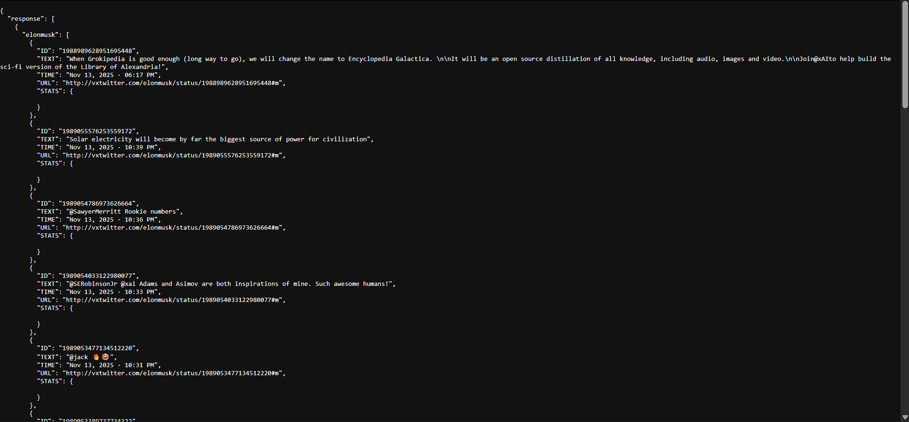

# 🐦 Twitter Telegram Bot (use own instance)

Scraping tweets has become increasingly difficult without paying high API fees or relying on third-party services like Nitter. However, since Nitter often imposes timeouts and access limits, this project recommend using private instance.

This Python bot scrapes tweets from Nitter, stores, and sends new tweet alerts to a Telegram channel — all without using the official Twitter API.


## 📸 Preview


*An overview of the bot’s scraping and alert process.*


## 🚀 Features

* 🧩 **Nitter Scraper** — use your own instance.
* 📢 **Telegram Integration** — Sends formatted tweet notifications to your Telegram channel.
* 🧠 **Randomized Headers** — Generates unique HTTP headers and cookies on every request to bypass scraping restrictions.
* ⚙️ **Error Handling** — Manages connection and parsing errors per user gracefully.


## 🧰 Requirements

* Python **3.8+**
* A **Telegram Bot API Key** (from [@BotFather](https://t.me/BotFather))


## 🔑 Environment Variables

Set these environment variables (or create a `.env` file):

```bash
API=<your_telegram_bot_api_key>
CHANNEL_ID=<your_telegram_channel_id>
MONGODB_URI=<your_mongodb_connection_uri>
```

